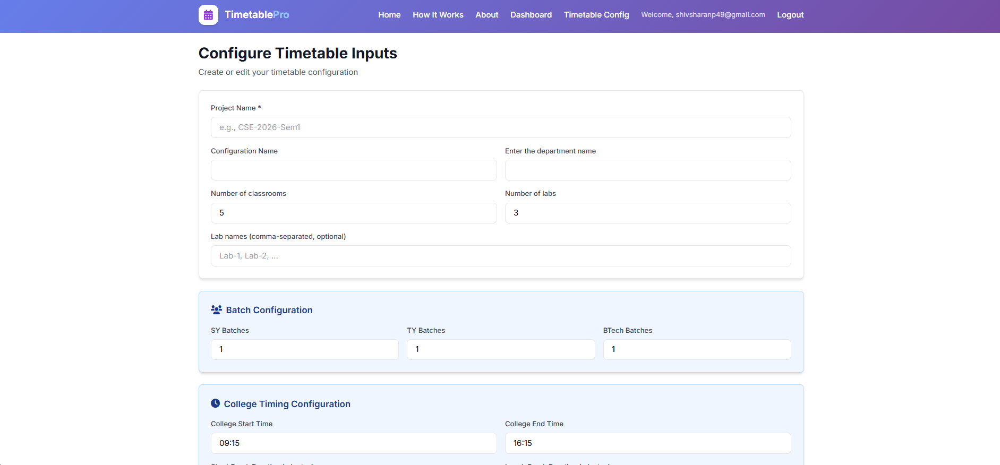
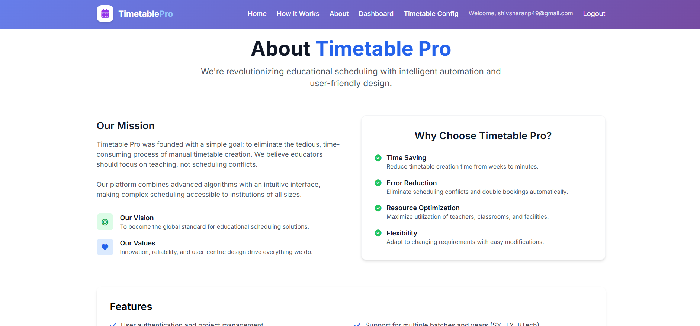

# TimetablePro

An AI-assisted Flask web app that automatically generates conflict-free college timetables with subject, faculty, and lab management.

---

## 🚀 Features
- User auth (login/signup), user-specific projects
- Configure classrooms, labs, batches, subjects (lectures + labs)
- Dedicated lab-first scheduling with conflict checks
- Download timetables (DOCX, XLSX, CSV)
- Dashboard to view/edit/delete timetables
- Tailwind CSS-based responsive UI

---

## 🖼️ Screenshots

> All images are stored in `statics/` and referenced with repository-relative paths.

### Home


### Configure Form


### Instructions


### Dashboard


### Timetables


### Login


### Signup


### About


---

## ⚙️ How to Run (Dev)

```bash
# In project root
python -m venv .venv
. .venv/Scripts/activate   # Windows PowerShell
pip install -r requirements.txt

# Run Flask app
python webapp/app.py
```

Configure your MySQL connection via environment variables if needed, or update the connection in `webapp/models.py` / `api/db.py`.

---

## Tech Stack
- Flask, SQLAlchemy, MySQL
- Tailwind CSS, Jinja2
- FastAPI (optional API), Uvicorn
- python-docx, openpyxl

